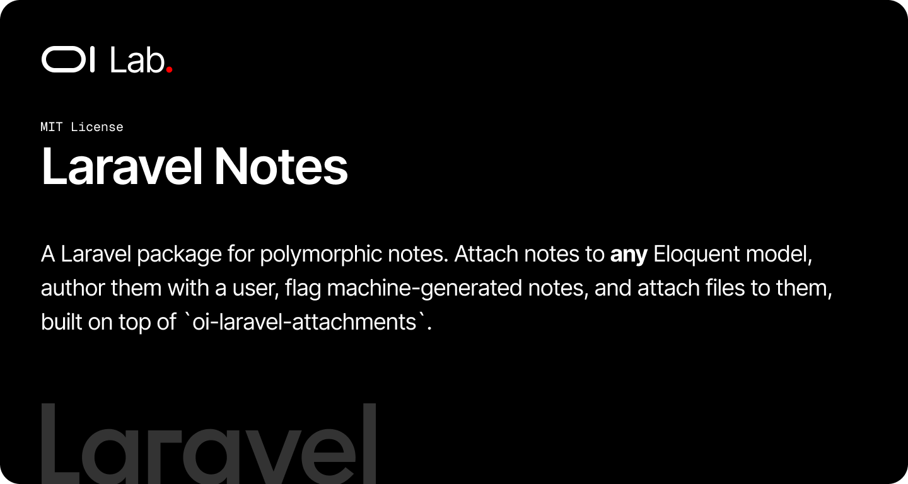

# OI Laravel Notes BETA

[](https://packagist.org/packages/oi-lab/oi-laravel-notes)
[](https://packagist.org/packages/oi-lab/oi-laravel-notes)
[](https://github.com/oi-lab/oi-laravel-notes/actions)
[](LICENSE)

A Laravel package for polymorphic notes. Attach notes to **any** Eloquent model, author them with a user,
flag machine-generated notes, and attach files to them — built on top of `oi-laravel-attachments`.

## Features

- **Polymorphic Notes**: Annotate any model via a single `HasNotes` trait
- **Authored & Bot Notes**: Optional author plus a `has_bot` flag for system-generated notes
- **File Attachments**: Notes are attachable — attach files via `oi-laravel-attachments`
- **Validation**: A ready-made `NoteRequest` form request with configurable file limits
- **Configurable Models**: Swap in your own `Note` or user model subclasses
- **UUIDs & Soft Deletes**: Every note has a unique `uuid` and is soft-deletable

## How It Works

The package revolves around a single `Note` model attached polymorphically to a `notable` parent. Host
models opt in with the `HasNotes` trait, which exposes a `notes()` relationship. The `Note` model itself
uses the `HasAttachments` trait, so any note can carry files. All package internals resolve model classes
through the `OiNotes` resolver, so you can override the `Note` or user model from config without touching
package code.

## Requirements

- PHP 8.2+
- Laravel 11.0+, 12.0+, or 13.0+
- [`oi-lab/oi-laravel-attachments`](https://packagist.org/packages/oi-lab/oi-laravel-attachments) ^1.0

## Installation

```bash
composer require oi-lab/oi-laravel-notes
```

The package auto-discovers and registers its service provider — no manual registration required.

### Local Development

For local development inside the monorepo, add a path repository to your main project's `composer.json`:

```json
{
    "repositories": [
        {
            "type": "path",
            "url": "./packages/oi-lab/oi-laravel-notes"
        }
    ]
}
```

Then:

```bash
composer require oi-lab/oi-laravel-notes
```

### Publish & Migrate

Publish the migrations (and optionally the config) and run them:

```bash
php artisan vendor:publish --tag=oi-laravel-notes-migrations
php artisan vendor:publish --tag=oi-laravel-notes-config
php artisan migrate
```

This creates the `notes` table.

## Configuration

The config file `config/oi-laravel-notes.php` exposes the following options:

```php
return [
    // Model used for the note author relationship
    'user_model' => 'App\Models\User',

    // Model classes used by the package — override with your own subclasses
    'models' => [
        'note' => OiLab\OiLaravelNotes\Models\Note::class,
    ],

    // Validation limits applied by NoteRequest
    'attachments' => [
        'max_files' => 10,
        'max_file_size' => 10240, // kilobytes
    ],
];
```

## Usage

### Make a Model Notable

Add the `HasNotes` trait to any model:

```php
use Illuminate\Database\Eloquent\Model;
use OiLab\OiLaravelNotes\Concerns\HasNotes;

class Order extends Model
{
    use HasNotes;
}
```

### Create & Read Notes

```php
$order->notes()->create([
    'message' => 'Customer called to confirm the address.',
    'user_id' => auth()->id(),
]);

$order->notes;            // all notes (MorphMany)
$order->notes()->latest()->first();
```

### Bot / System Notes

```php
$order->notes()->create([
    'message' => 'Status automatically advanced to shipped.',
    'has_bot' => true,
]);
```

### Attach Files to a Note

A `Note` is attachable via `oi-laravel-attachments`:

```php
use OiLab\OiLaravelAttachments\Actions\AttachUploadedFiles;

$note = $order->notes()->create(['message' => 'Signed delivery slip attached.']);

AttachUploadedFiles::handle($note, $request->file('files'));

$note->attached_files; // Collection of File models
```

### Validating Input

`OiLab\OiLaravelNotes\Http\Requests\NoteRequest` validates the message and uploaded files against the
configured limits. Use it directly in a controller or extend it for your own rules.

## Overriding the Note Model

Resolve models through `OiNotes` so your overrides apply everywhere:

```php
// config/oi-laravel-notes.php
'models' => [
    'note' => App\Models\Note::class, // extends OiLab\OiLaravelNotes\Models\Note
],
```

## AI Assistant Skills

Install Claude Code / JetBrains Junie skill files and a `CLAUDE.md` rules section into your app:

```bash
php artisan oi:install-ai-skill
```

## Testing

```bash
composer test
```

## License

The MIT License (MIT). Please see the [License File](LICENSE) for more information.
